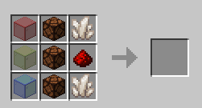

# Color Blocks

Color Blocks is a mod for Minecraft Java Edition. It runs on the version 1.20.4 using the [Fabric](https://fabricmc.net) Loader. This guide will cover how to install, and use this mod.

## Installation
This mod will run without any dependencies. Just install fabric and drop the jar file in the `mods` folder located in `%appdata%/.minecraft/` to install the mod.

## Usage
Once installed, you will be able to obtain the added, "RGB Lamp" in the Redstone tab of the creative section or by using this crafting recipe:

When giving the block a redstone signal, the block will change color depending on the strength of the signal. Here are all of the colors and their corresponding signal strenghts:

 - 0 - black
 - 1 - red
 - 2 - orange
 - 3 - yellow
 - 4 - lime
 - 5 - green
 - 6 - cyan
 - 7 - light blue
 - 8 - blue
 - 9 - purple
 - 10 - magenta
 - 11 - pink
 - 12 - brown
 - 13 - gray
 - 14 - light gray
 - 15 - white 

This block also can only be collected by a pickaxe with silk touch. This mod is intended for redstone but can be used in building as well.

## Bugs, Glitches and Issues

If there are any problems with this mod, report it [here](https://github.com/wet-noodles90/ColorBlocks/issues).
